  

I’m an engineering student focused on cybersecurity, Linux systems, and low-level computing.

My interests revolve around understanding how real-world systems work internally, how they fail, and how they can be secured. I enjoy going beyond surface-level development through system analysis, offensive security labs, automation, reverse engineering, and embedded experimentation.

Current areas of focus:
- Offensive security & penetration testing labs
- Linux internals, networking, and system exploitation
- Security automation using Python, Bash, and scripting
- Web & Android security fundamentals
- Reverse engineering & malware analysis fundamentals
- IoT and embedded system workflows

---

## 🧠 Skills

### Languages
- Python
- C
- Bash
- Java

### Systems & Security
- Linux
- System internals
- Networking fundamentals
- Traffic analysis
- Vulnerability assessment
- Enumeration & recon workflows
- Privilege escalation
- Reverse engineering fundamentals

### Tools
- Wireshark
- Burp Suite
- Nmap
- Metasploit
- Ghidra
- CyberChef
- Git
- Docker
- VirtualBox
- QEMU

---

## 💼 Experience

### Wimera Systems — Summer Intern
- Exposure to ESP32-based IoT and embedded workflows
- Worked with dashboard monitoring and device testing
- Explored Matter protocol concepts and smart-device communication

### Saiket Systems - ML Intern
- Worked on classification and anomaly-detection workflows using Python
- Performed preprocessing and model experimentation on security-related datasets
- Documented workflows and experimental observations for reproducibility
- Explored practical applications of machine learning in cybersecurity contexts

### InlighnX Global Pvt. Ltd. - Offensive Cybersecurity Intern
- Vulnerability assessment and penetration testing labs
- Security scripting and automation utilities
- Exposure to hashing algorithms, recon, and enumeration workflows

---

## 🌐 Profiles

  
  &nbsp;&nbsp;
  
  &nbsp;&nbsp;
  

---

## 📈 Activity

  

---

## 📫 Contact

- **Email:** [vkumxr@proton.me](mailto:vkumxr@proton.me)
- **Portfolio:** https://vishwakumarv.github.io/

---

  

